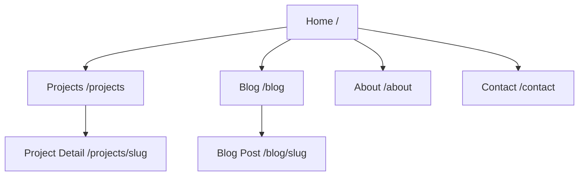
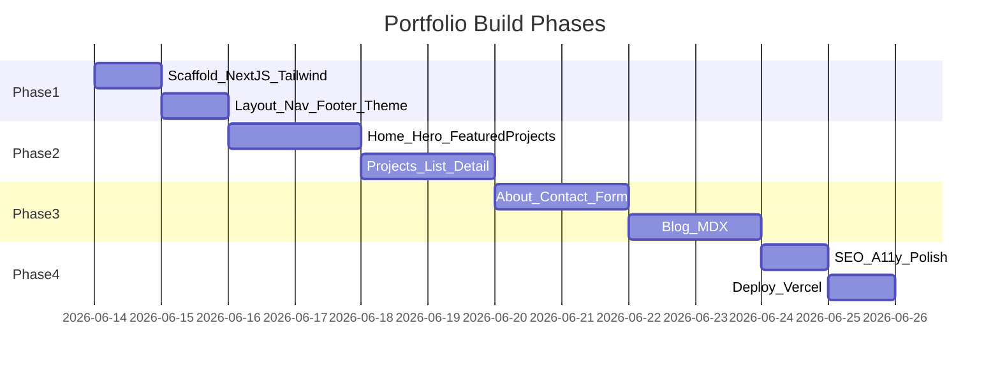

> **Archived product spec** — see README for current setup.

# Personal Portfolio Website — Product Requirements Document

**Version:** 1.0  
**Last updated:** June 13, 2026  
**Status:** Approved for implementation  
**Owner:** Portfolio site owner  

---

## 1. Overview and Goals

### Vision

A polished personal portfolio that positions the site owner as a full-stack engineer who cares about UX, visual design, and performance — not just a list of repos. The website itself is a portfolio piece: fast, accessible, thoughtfully designed, and built with modern best practices.

### Primary Goals

1. **Get hired or land freelance clients** — Clear value proposition, prominent CTAs, and easy contact paths for recruiters and potential clients.
2. **Demonstrate technical competence** — The site showcases code quality through its own implementation: App Router architecture, typed content models, optimized images, and thoughtful UX patterns.
3. **Make discovery effortless** — Recruiters and clients can quickly understand skills, browse case studies, download a resume, and reach out within seconds.

### Success Metrics (Measurable)

| Metric | Target | Measurement |
|--------|--------|-------------|
| Lighthouse Performance | ≥ 90 | Chrome DevTools / PageSpeed Insights |
| Lighthouse Accessibility | ≥ 95 | Automated audit |
| Lighthouse SEO | ≥ 95 | Automated audit |
| Contact form submissions | Trackable | Resend delivery logs or analytics (v2) |
| Project detail engagement | Baseline established | Time on `/projects/[slug]` (optional analytics v2) |

### Resolved Decisions (Open Questions)

The following open questions from the planning phase have been resolved with sensible defaults for v1:

| Question | Decision |
|----------|----------|
| **Domain** | Vercel subdomain (`*.vercel.app`) for initial launch; custom domain can be added later in Vercel project settings |
| **Accent color** | Indigo/violet (`#6366f1` / Tailwind `indigo-500`) — modern, professional, works in light and dark mode |
| **Contact backend** | Resend API via Next.js API route; graceful fallback when `RESEND_API_KEY` is unset (show success UI + console log, mailto link as secondary CTA) |
| **Project content** | 5 high-quality placeholder case studies with realistic full-stack + design narratives |
| **Blog priority** | Launch with blog on day 1 — 3 starter MDX posts included |

---

## 2. Target Audience

### Persona Matrix

| Persona | Primary Needs | Key Pages | Success Signal |
|---------|---------------|-----------|----------------|
| **Recruiter / hiring manager** | Quick scan of skills, notable projects, resume download | Hero, About, Projects, Resume CTA | Resume click or contact form submission |
| **Engineering lead / peer** | Code quality signals, tech stack depth, case study depth | Projects (detail), Blog | Time on project detail pages, blog reads |
| **Potential client** | Proof of design + build capability, clear CTA | Projects, About, Contact | Contact form or email click |

### User Journeys

**Recruiter (60-second scan):**
1. Lands on home → reads hero tagline
2. Scrolls featured projects → clicks one case study
3. Downloads resume or navigates to Contact

**Peer developer (deep dive):**
1. Browses `/projects` with tag filters
2. Reads full case study with tech stack and results
3. Checks blog for technical writing samples

**Potential client (evaluation):**
1. Reviews About page for skills and bio
2. Browses 2–3 project case studies
3. Submits contact form with project inquiry

---

## 3. Information Architecture

### Site Structure

Multi-page App Router site with shared layout, persistent navigation, and smooth scroll animations on the home page.



### Navigation (Persistent Header)

| Item | Route | Notes |
|------|-------|-------|
| Home | `/` | Logo links here |
| Projects | `/projects` | Filterable grid |
| Blog | `/blog` | MDX post list |
| About | `/about` | Extended bio + skills |
| Contact | `/contact` | Form + mailto fallback |
| Resume | `/resume.pdf` | Secondary CTA button (download) |

### Footer

- Copyright + site name
- GitHub and LinkedIn icon links
- Theme toggle (also in header)
- Optional: "Built with Next.js" credit

---

## 4. Feature Requirements

### Must Have (P0)

| Feature | Description | Acceptance Criteria |
|---------|-------------|---------------------|
| **Hero section** | Name, role tagline, value prop, CTAs | Full-viewport on desktop; CTAs link to `/projects` and `/contact` |
| **Projects showcase** | Grid of 4–8 featured projects | Thumbnail, title, tags, short description; top 3 on home |
| **Project detail pages** | Case-study layout at `/projects/[slug]` | Overview, Challenge, Solution, Tech Stack, Results; live + repo links |
| **About page** | Bio, grouped skills, social links | Skills grouped: Frontend / Backend / Design / Tools |
| **Contact form** | Name, email, subject, message | API route; success/error states; honeypot spam protection |
| **Responsive design** | Mobile-first | Works 320px–1440px+ without horizontal scroll |
| **SEO basics** | Metadata, OG tags, sitemap, robots | Unique title/description per route |
| **Dark/light mode** | System default + manual toggle | Persisted in `localStorage`; no flash on load |

### Should Have (P1)

| Feature | Description | Acceptance Criteria |
|---------|-------------|---------------------|
| **Blog (MDX)** | 3 starter posts with tags and reading time | Syntax highlighting for code blocks; related posts on detail |
| **Animations** | Framer Motion scroll reveals | Respects `prefers-reduced-motion` |
| **Resume PDF** | Downloadable at `/resume.pdf` | Linked from nav CTA |
| **404 page** | Branded not-found page | Links back to home and projects |

### Nice to Have (P2 — Out of v1 Scope)

- CMS integration (Sanity, Contentful)
- Analytics (Plausible, Vercel Analytics)
- Testimonials section
- Interactive playground / mini demo component

---

## 5. Page Specifications

### Home (`/`)

| Section | Content |
|---------|---------|
| Hero | Animated headline, name, "Full-Stack Developer & Designer" tagline, value prop, "View Work" + "Get in Touch" CTAs |
| Featured Projects | Top 3 featured projects as cards linking to detail pages |
| Skills | Icon grid or marquee: React, TypeScript, Node.js, PostgreSQL, Figma, etc. |
| About Teaser | 2–3 sentences + "Read more" → `/about` |
| Contact CTA | Short prompt + button → `/contact` |

### Projects (`/projects`)

- Filterable grid by tag (All, React, Node, Design, etc.)
- Card: image, title, tags, one-liner, link to detail
- Empty state when filter matches nothing

### Project Detail (`/projects/[slug]`)

| Section | Content |
|---------|---------|
| Hero | Project title, tags, hero image/mockup |
| Overview | What the project is and who it's for |
| Challenge | Problem statement |
| Solution | Approach and key decisions |
| Tech Stack | Tag list of technologies used |
| Results | Outcomes, metrics, learnings |
| Links | Live demo + GitHub (when available) |

### Blog (`/blog`) and Post (`/blog/[slug]`)

- Post list sorted by date (newest first)
- Each card: title, date, tags, excerpt, reading time
- MDX content with code blocks, images
- Related posts footer (same-tag matching)

### About (`/about`)

- Extended bio (2–3 paragraphs)
- Skills matrix grouped by category with proficiency indicators
- "Currently" section (what you're working on / learning)
- Social links (GitHub, LinkedIn, email)

### Contact (`/contact`)

| Field | Required | Notes |
|-------|----------|-------|
| Name | Yes | Text input |
| Email | Yes | Email validation |
| Subject | No | Optional text input |
| Message | Yes | Textarea, min length |
| Honeypot | Hidden | `website` field — reject if filled |

- Success state after submission
- Error state with retry guidance
- Mailto fallback: `hello@example.com`
- Social links below form

---

## 6. Design Requirements

### Aesthetic Direction

Clean, modern developer-craftsmanship: generous whitespace, strong typography, restrained neutral palette with indigo/violet accent. The design itself is a portfolio piece.

### Design Tokens

| Token | Value |
|-------|-------|
| **Display font** | Geist Sans via `next/font` |
| **Body font** | Inter via `next/font` |
| **Accent color** | `#6366f1` (indigo-500) — resolved default |
| **Neutral base** | Slate/zinc scale for backgrounds and text |
| **Max content width** | ~1200px (`max-w-6xl`) |
| **Spacing grid** | 8px base (Tailwind default) |
| **Border radius** | `rounded-lg` / `rounded-xl` for cards |
| **Shadows** | Subtle in light mode; border-based in dark mode |

### Component Inventory

| Component | Location | Variants |
|-----------|----------|----------|
| Button | `components/ui/Button.tsx` | primary, secondary, ghost, outline |
| Card | `components/ui/Card.tsx` | default, hover lift |
| Tag | `components/ui/Tag.tsx` | default, accent |
| Input / Textarea | `components/ui/Input.tsx` | default, error state |
| Nav | `components/sections/Header.tsx` | desktop links, mobile menu |
| Footer | `components/sections/Footer.tsx` | — |
| Section wrapper | `components/ui/Section.tsx` | with optional title |
| Theme toggle | `components/ui/ThemeToggle.tsx` | sun/moon icons |

### Wireframe Descriptions

**Home — Mobile (320px):**
- Stacked layout: logo + hamburger → full-width hero text → stacked project cards → skills grid (2 cols) → about teaser → contact CTA → footer

**Home — Desktop (1440px):**
- Horizontal nav with resume CTA → hero with large display type, CTAs side by side → 3-column featured projects → 4–6 column skills grid → two-column about teaser + image placeholder → contact CTA band → footer

**Project Detail:**
- Full-width hero image → single-column prose sections → sticky side panel with links on desktop

### Accessibility

- WCAG 2.1 AA contrast ratios (4.5:1 text, 3:1 large text)
- Keyboard navigable with visible `:focus-visible` rings (accent color)
- Semantic HTML: `<nav>`, `<main>`, `<article>`, `<section>`, heading hierarchy
- Alt text on all images
- `prefers-reduced-motion: reduce` disables Framer Motion animations
- Form labels associated with inputs; error messages announced
- Skip-to-content link in header

---

## 7. Technical Requirements

### Stack

| Layer | Choice |
|-------|--------|
| Framework | Next.js 15 (App Router) |
| Language | TypeScript (strict) |
| Styling | Tailwind CSS v4 |
| Animation | Framer Motion |
| Content — Blog | MDX with `@next/mdx` or `next-mdx-remote` |
| Content — Projects | JSON files in `content/projects/` |
| Forms | Next.js API Route + Resend |
| Deployment | Vercel |
| Fonts | `next/font` (Geist, Inter) |

### Project Structure

```
app/
  layout.tsx              # Root layout, fonts, theme provider
  page.tsx                # Home
  not-found.tsx           # Branded 404
  sitemap.ts              # Dynamic sitemap
  robots.ts               # Robots.txt
  projects/
    page.tsx              # Projects list with filter
    [slug]/page.tsx       # Project detail
  blog/
    page.tsx              # Blog list
    [slug]/page.tsx       # Blog post
  about/page.tsx
  contact/page.tsx
  api/contact/route.ts    # Contact form handler
components/
  ui/                     # Button, Card, Input, Tag, Section, ThemeToggle
  sections/               # Header, Footer, Hero, ProjectsGrid, ContactForm
content/
  projects/               # JSON per project
  blog/                   # MDX posts
lib/
  projects.ts             # Project data helpers
  blog.ts                 # Blog data helpers
  mdx.ts                  # MDX utilities
  utils.ts                # cn(), formatDate(), etc.
public/
  resume.pdf              # Placeholder resume
  images/                 # Project thumbnails, OG image
```

### Data Models

```typescript
type Project = {
  slug: string
  title: string
  description: string
  longDescription?: string
  tags: string[]
  image: string
  liveUrl?: string
  repoUrl?: string
  featured: boolean
  date: string
  overview: string
  challenge: string
  solution: string
  results: string
  stack: string[]
}

type BlogPost = {
  slug: string
  title: string
  date: string
  tags: string[]
  excerpt: string
  readingTime: string
  content: string // MDX body
}
```

### Environment Variables

| Variable | Required | Description |
|----------|----------|-------------|
| `RESEND_API_KEY` | No (fallback mode) | Resend API key for email delivery |
| `CONTACT_EMAIL` | No | Destination inbox (default: placeholder) |
| `NEXT_PUBLIC_SITE_URL` | No | Canonical URL for sitemap/OG (default: Vercel URL) |

### Contact Form — Resend with Fallback

1. **Production (API key set):** POST to `/api/contact` → Resend sends email to `CONTACT_EMAIL`
2. **Development (no API key):** Log payload to server console, return 200, show success UI to user
3. **Always available:** Mailto link on contact page as alternative

### Security

- Honeypot field rejects bot submissions
- Rate limiting via simple in-memory counter (v1) or Vercel edge middleware (v2)
- No user-generated HTML rendered without sanitization
- Environment secrets never exposed to client

---

## 8. Content Requirements

### Owner Checklist (Replace Placeholders Before Launch)

- [ ] Professional headshot or avatar
- [ ] Bio (short ~50 words + long ~200 words) — placeholders included
- [ ] Resume PDF — placeholder PDF in `public/`
- [ ] 4–8 project entries — 5 placeholder case studies included
- [ ] GitHub, LinkedIn, social URLs — placeholder links included
- [ ] 1–3 blog posts — 3 starter MDX posts included
- [ ] Brand accent color — default indigo `#6366f1` (change in Tailwind config)
- [ ] Domain name — Vercel subdomain for now

### Placeholder Content Included in v1 Build

| Content | Count | Notes |
|---------|-------|-------|
| Projects | 5 | Realistic full-stack case studies |
| Blog posts | 3 | Technical writing samples |
| Bio | 1 short + 1 long | Generic developer persona "Alex Morgan" |
| Resume | 1 PDF placeholder | Minimal PDF in public/ |

---

## 9. Non-Functional Requirements

| Category | Requirement | Implementation |
|----------|-------------|----------------|
| **Performance** | LCP < 2.5s | `next/image` with WebP/AVIF, font subsetting, minimal JS |
| **SEO** | Unique metadata per route | `generateMetadata()` on each page; Person schema on home |
| **Security** | Form protection, secret handling | Honeypot, env vars server-only |
| **Browser support** | Last 2 versions Chrome, Firefox, Safari, Edge | Standard CSS, no experimental APIs |
| **Maintainability** | Typed models, linting | TypeScript strict, ESLint, README |
| **Accessibility** | WCAG 2.1 AA | Semantic HTML, focus states, reduced motion |

### Structured Data (Home Page)

```json
{
  "@context": "https://schema.org",
  "@type": "Person",
  "name": "Alex Morgan",
  "jobTitle": "Full-Stack Developer",
  "url": "https://your-site.vercel.app",
  "sameAs": ["https://github.com/", "https://linkedin.com/in/"]
}
```

---

## 10. Implementation Phases

### Phase Overview



| Phase | Scope | Deliverables |
|-------|-------|--------------|
| **Phase 1 — Foundation** | Next.js scaffold, Tailwind, layout, nav, footer, dark mode | Runnable dev server with themed layout |
| **Phase 2 — Core pages** | Home, Projects list + detail, static project content | All project routes working with placeholder content |
| **Phase 3 — Engagement** | About, Contact form + email, Blog with MDX | Contact API, 3 blog posts readable |
| **Phase 4 — Polish & launch** | SEO, a11y audit, animations, 404, README | Production build passes, deploy-ready |

**Total estimate:** ~7–10 days for a solo developer

---

## 11. Out of Scope (v1)

- User authentication / admin panel
- CMS-backed content editing (Sanity, Contentful)
- E-commerce or payments
- Multi-language i18n
- Comments on blog posts
- Automated CI/CD beyond Vercel defaults
- CAPTCHA on contact form (honeypot only for v1)
- Analytics integration (noted for v2)
- Testimonials section
- Interactive playground / mini demo

---

## 12. Open Questions — Resolved

All open questions from planning have been resolved for v1 implementation:

### 1. Domain name

**Decision:** Vercel subdomain (`*.vercel.app`) for initial launch.  
**Rationale:** Zero cost, instant HTTPS, easy to add custom domain later in Vercel dashboard.  
**Action:** Set `NEXT_PUBLIC_SITE_URL` env var after first deploy.

### 2. Brand accent color

**Decision:** Indigo/violet — `#6366f1` (Tailwind `indigo-500`).  
**Rationale:** Modern, professional, excellent contrast in both light and dark themes, commonly associated with developer tools and SaaS products.  
**Action:** Defined in Tailwind theme extension; easily swappable.

### 3. Contact form backend

**Decision:** Resend API with graceful fallback.  
**Rationale:** Free tier (100 emails/day), simple API, good DX with Next.js.  
**Fallback behavior:** When `RESEND_API_KEY` is unset, API route logs submission to console and returns success; contact page shows mailto link as always-available alternative.  
**Action:** Add `RESEND_API_KEY` and `CONTACT_EMAIL` to Vercel env vars for production.

### 4. Project content

**Decision:** 5 high-quality placeholder case studies.  
**Rationale:** Allows full UI/UX validation before owner provides real content.  
**Projects included:** SaaS dashboard, e-commerce platform, design system, real-time chat app, portfolio CMS.  
**Action:** Owner replaces JSON files in `content/projects/` with real case studies.

### 5. Blog priority

**Decision:** Launch with blog on day 1 — 3 starter MDX posts.  
**Rationale:** Demonstrates technical writing ability; low incremental effort with MDX setup.  
**Posts included:** "Building accessible React components", "Why I chose Next.js App Router", "Design tokens in Tailwind CSS".  
**Action:** Owner adds real posts to `content/blog/` over time.

---

## Appendix: Deployment Checklist

- [ ] Run `npm run build` locally — zero errors
- [ ] Push to GitHub repository
- [ ] Connect repo to Vercel
- [ ] Set environment variables: `RESEND_API_KEY`, `CONTACT_EMAIL`, `NEXT_PUBLIC_SITE_URL`
- [ ] Verify contact form in production
- [ ] Run Lighthouse audit — meet score targets
- [ ] Replace placeholder content (bio, projects, resume, social links)
- [ ] Optional: Add custom domain in Vercel settings

---

*End of PRD*

